# Library Management System


A full-stack Library Management System built with Java 17, Spring Boot 3.5, React 19, Vite 8, Tailwind CSS 4, and MySQL. The application provides role-based dashboards for administrators, librarians, students, and public users while supporting book management, circulation, announcements, complaints, and feedback.

---

## Homepage

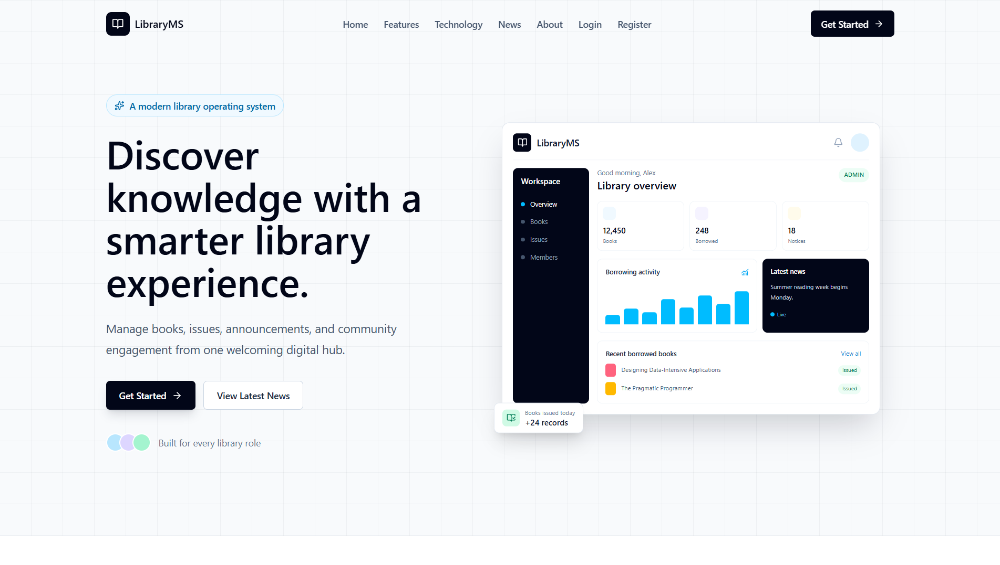

---

## Overview

This project was developed to demonstrate a complete library management workflow using a modern Java backend and a React frontend.

The application supports three authenticated roles—Administrator, Librarian, and Student—each with its own dashboard and permissions. Public visitors can browse the landing page, register as students, and read published announcements without signing in.

The system manages books, categories, borrowing records, announcements, complaints, and feedback while using JWT-based authentication and role-based authorization.

---

## Features

### Authentication

- JWT Authentication
- Spring Security
- BCrypt Password Encryption
- Role-Based Authorization

### Admin

- Dashboard
- Manage Books
- Manage Categories
- Manage Librarians
- Manage Students
- Manage Book Issues
- Publish News
- View Complaints
- View Feedback

### Librarian

- Dashboard
- Manage Books
- Issue Books
- Return Books
- View Published News

### Student

- Dashboard
- Browse Books
- Search Books
- View Issue History
- Submit Complaints
- Submit Feedback
- Read News

### Public

- Responsive Landing Page
- Public News Page
- Student Registration
- Login

---

## Modules

- Authentication & Authorization
- Dashboard
- Book Management
- Category Management
- Book Issue & Return Management
- News Management
- Complaint Management
- Feedback Management

---

## Technology Stack

| Layer             | Technology                     |
|-------------------|--------------------------------|
| Language          | Java 17                        |
| Backend           | Spring Boot 3.5                |
| Frontend          | React 19 + Vite 8              |
| Styling           | Tailwind CSS 4                 |
| Database          | MySQL                          |
| Security          | Spring Security, JWT, BCrypt   |
| ORM               | Spring Data JPA / Hibernate    |
| API Documentation | Swagger UI (OpenAPI 3)         |
| Build Tools       | Maven 3.9, npm 10              |
| HTTP Client       | Axios 1                        |
| Routing           | React Router 7                 |

---

## Architecture

The project follows a client-server architecture.

- **Frontend:** React 19 + Vite 8 application responsible for the user interface.
- **Backend:** Spring Boot 3.5 REST API handling authentication, business logic, and database operations.
- **Database:** MySQL for persistent data storage.
- **Authentication:** JWT-based authentication with Spring Security and BCrypt password hashing.
- **API Communication:** Axios is used by the frontend to communicate with the backend REST APIs.

---

## Project Structure

```text
src/
├── main/
│   ├── java/
│   │   ├── config
│   │   ├── controller
│   │   ├── dto
│   │   ├── entity
│   │   ├── exception
│   │   ├── repository
│   │   ├── security
│   │   └── service
│   └── resources
├── test/
│
frontend/
docs/
```

---

## Screenshots

### Login

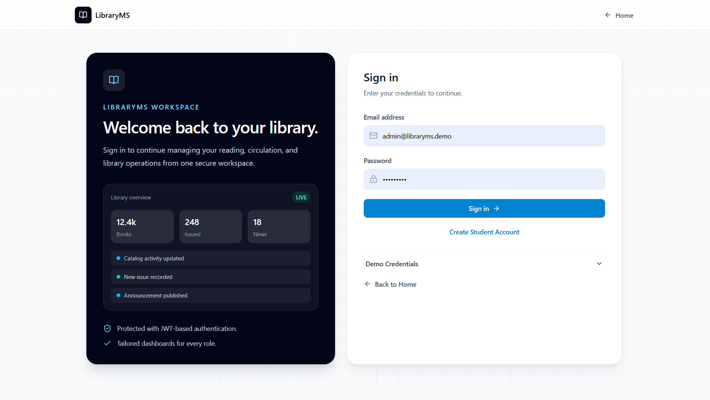

### Register

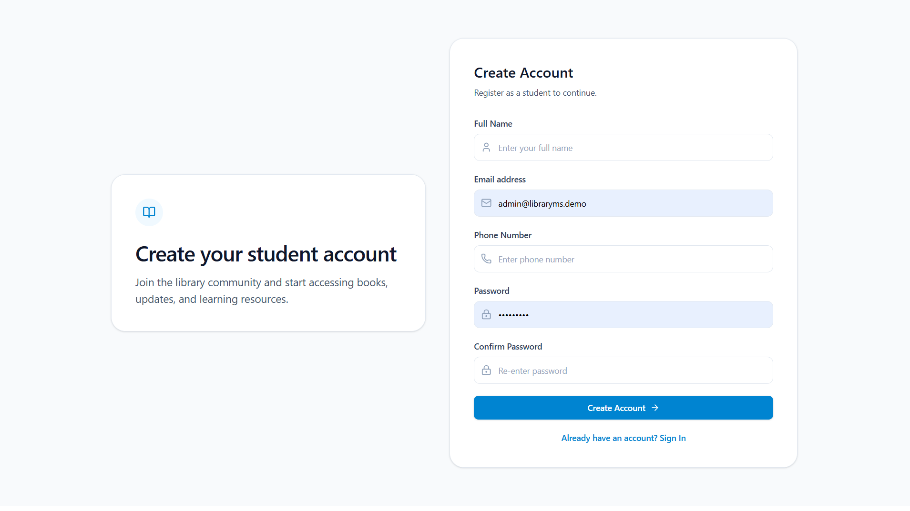

### Admin Dashboard

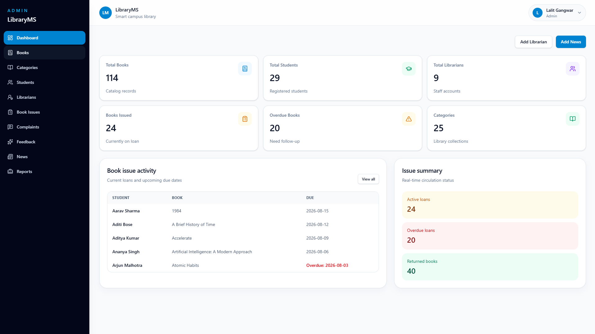

### Librarian Dashboard

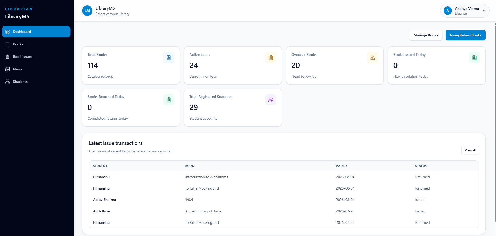

### Student Dashboard

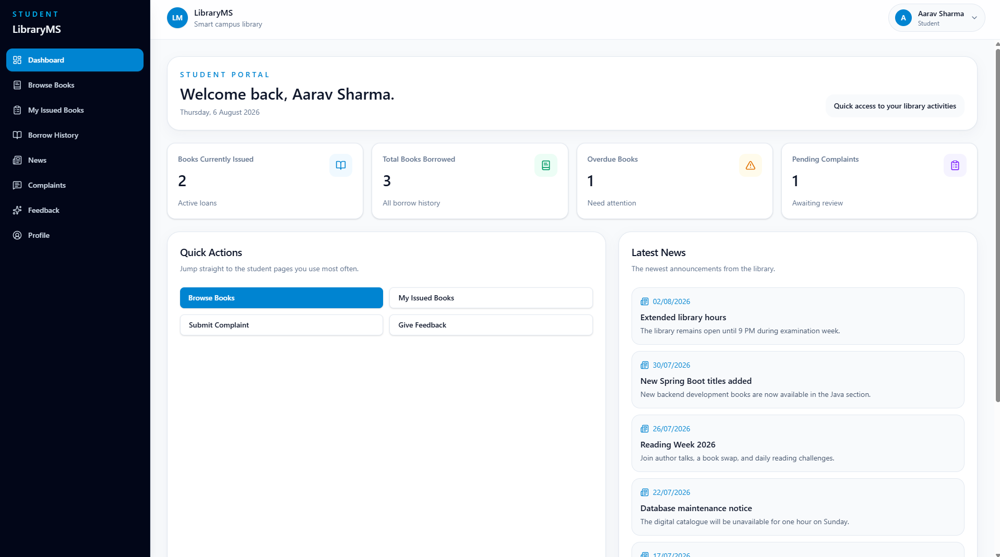

### Book Management

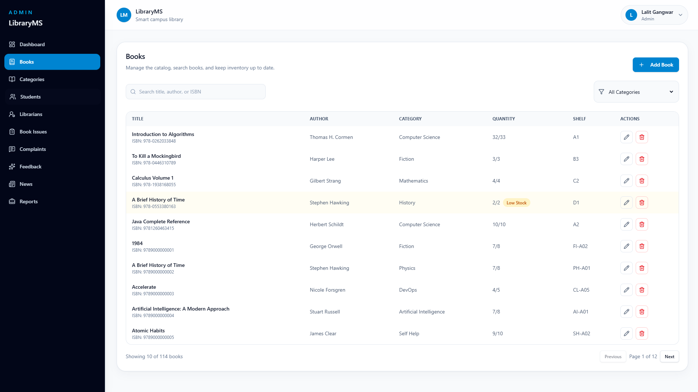

### Book Issues

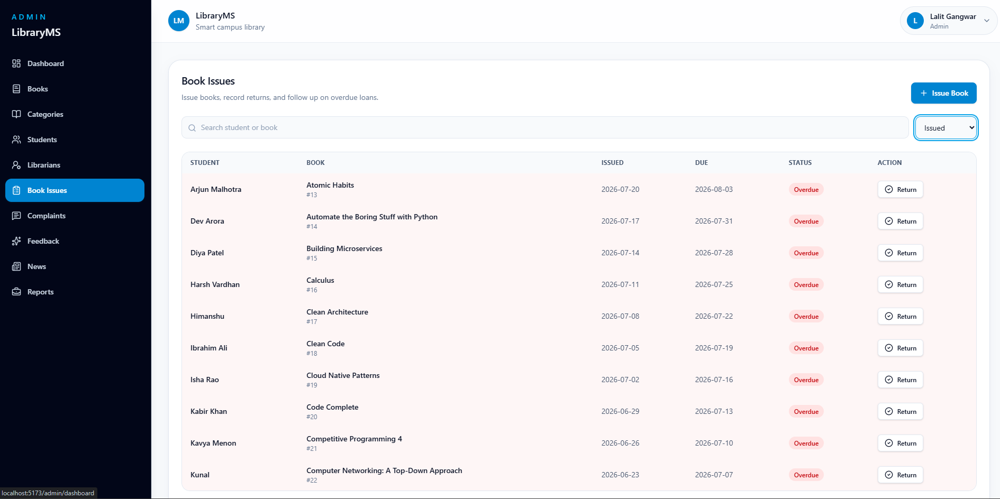

### News Management

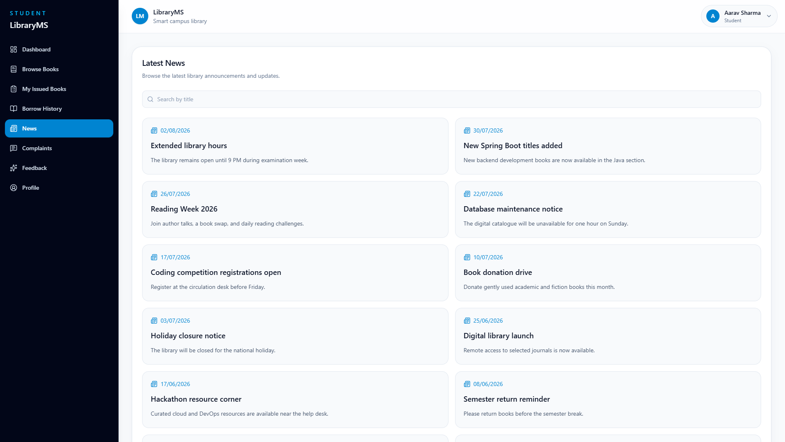

### Complaints

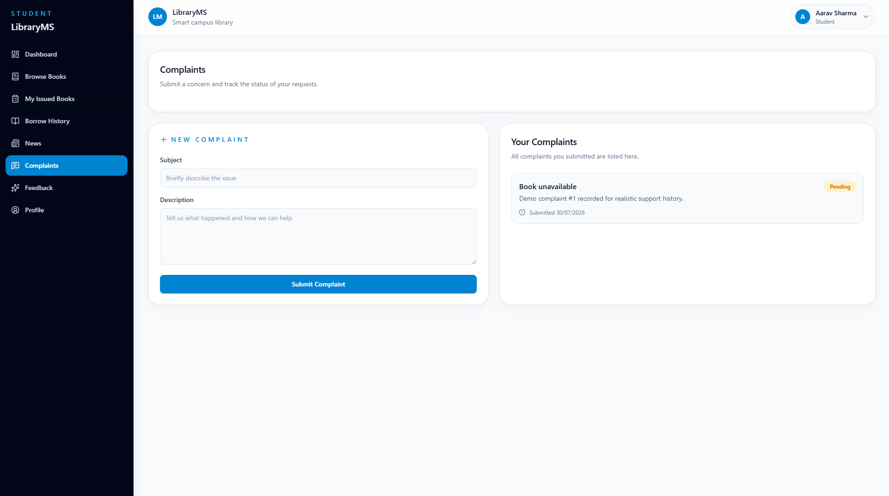

### Feedback

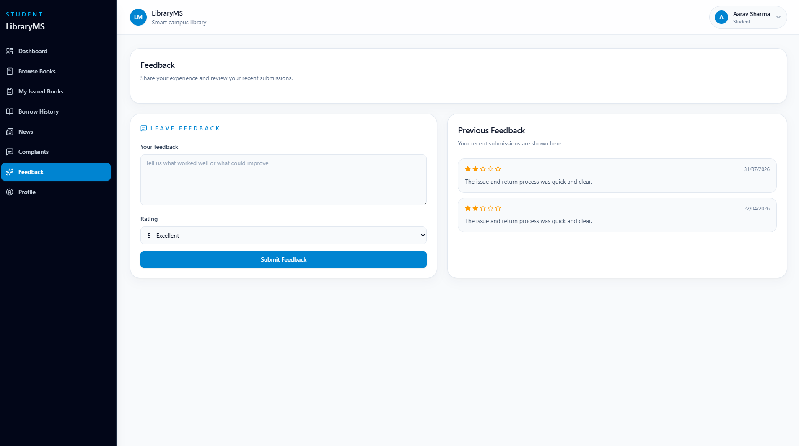

---

## Database

The application uses **MySQL** as its relational database.

Database operations are handled using **Spring Data JPA** and **Hibernate**, allowing the application to interact with the database through entity classes and repositories.

---

## API Documentation

Swagger UI is available after starting the backend and can be accessed at:

```text
http://localhost:8080/swagger-ui/index.html
```

---

## Getting Started

### 1. Clone the Repository

```bash
git clone https://github.com/lalitgangwar0812/library-management-system.git
cd library-management-system
```

### 2. Create a MySQL Database

Create an empty MySQL database.

### 3. Import Demo Data

Import the sample dataset located at:

```text
docs/mysql-demo-data.sql
```

### 4. Configure the Database

Update the database connection details in:

```text
src/main/resources/application.properties
```

### 5. Run the Backend

```bash
./mvnw spring-boot:run
```

### 6. Run the Frontend

```bash
cd frontend
npm install
npm run dev
```

### 7. Open the Application

Open the URL displayed by Vite (typically `http://localhost:5173`).

---

## Demo Data

The repository includes a sample MySQL dataset (`docs/mysql-demo-data.sql`) that populates the application with realistic records, allowing the system to be explored immediately after setup.

The demo data includes:

- Admin account
- Librarian accounts
- Student accounts
- Book categories
- Book catalog
- Book issue records
- Published news
- Complaints
- Feedback

---

## Demo Credentials

| Role | Email | Password |
|------|-------|----------|
| Admin | `admin@libraryms.demo` | `Admin@123` |
| Librarian | `ananya.verma@libraryms.demo` | `Library@123` |
| Student | `aarav.sharma@student.demo` | `Student@123` |

---

## Future Improvements

- Fine calculation for overdue books
- Book reservation system
- Email notifications
- Barcode / QR code support
- Docker support
- PostgreSQL support
- Cloud deployment

---

## Author

**Lalit Gangwar**

- GitHub: [lalitgangwar0812](https://github.com/lalitgangwar0812)
- LinkedIn: [Lalit Gangwar](https://www.linkedin.com/in/lalitgangwar0812/)
- Email: <lalitgangwar0812@gmail.com>

---

## License

This project is licensed under the **MIT License**. See the [LICENSE](LICENSE) file for details.